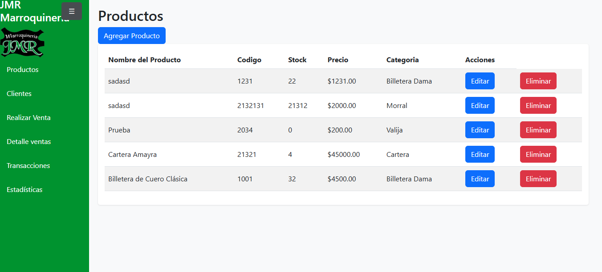

# 👜 JMRProyectoExpressJS

Aplicación web desarrollada con **Node.js** y **Express** para la gestión de productos, ventas y control de stock de un negocio de marroquinería.  
Incluye un **frontend con HTML, CSS y JavaScript** para la interacción del usuario, y un **backend con Express** que gestiona rutas, middlewares y la lógica de negocio.

---

## 📸 Vista del Proyecto



> 👉 Reemplazá `./docs/preview.png` con la ruta donde guardes tu imagen (por ejemplo, `assets/preview.png`).

---

## 🚀 Funcionalidades principales

- **Gestión de Productos**
  - Alta, baja y modificación de productos.
  - Listado de productos disponibles.
  - Vista de detalle de cada producto.

- **Gestión de Ventas**
  - Registrar una venta de productos.
  - Reducción automática de stock al realizar una venta.
  - Eliminación de ventas (con devolución de stock).
  - Visualización de detalles de ventas (incluyendo fecha y hora de Argentina).

- **Control de Stock**
  - Sincronización del inventario en base a ventas y devoluciones.

- **Frontend**
  - Páginas HTML con formularios y listados.
  - Visualización de productos y ventas.
  - Botones de acción (crear, editar, eliminar).

- **Middlewares**
  - Configuración de **CORS**.
  - Logging básico de solicitudes.
  - Espacio para validaciones personalizadas.

---

## 🛠️ Tecnologías utilizadas

| Tecnología | Uso |
|------------|-----|
| **Node.js** | Plataforma de ejecución |
| **Express** | Framework web backend |
| **HTML / CSS / JavaScript** | Interfaz del cliente (frontend) |
| **CORS** | Control de recursos entre dominios |
| **Middlewares personalizados** | Logging, validaciones y configuración extra |
| **Variables de entorno (.env)** | Configuración del entorno de ejecución |

---

## 📂 Estructura del proyecto

JMRProyectoExpressJS/
│
├── server.js # Punto de arranque del servidor
├── routes.js # Definición de rutas principales
├── middlewares/ # Middlewares personalizados
│ ├── middlewares.js
│ └── cors.js
├── frontend/ # Archivos HTML, CSS, JS del cliente
│ ├── index.html
│ ├── detallesventas.html
│ └── ...
├── package.json # Dependencias y scripts
├── .env # Variables de entorno
├── .gitignore
└── README.md


---

## ⚙️ Instalación y uso

1. Clonar el repositorio:
   ```bash
   git clone https://github.com/gonza-rom/JMRProyectoExpressJS.git
   cd JMRProyectoExpressJS

-2. Instalar dependencias:
npm install

-3. Iniciar el servidor: 
node server.js o en modo desarrollo con nodemon: npm run dev

-4. Abrir en el navegador:
http://localhost:3002

📌 Posibles mejoras

Conexión a base de datos (PostgreSQL, MongoDB, etc.).

Autenticación y roles de usuario.

Validación más robusta de datos.

Manejo centralizado de errores.

Pruebas unitarias y de integración.

👨‍💻 Autor

Desarrollado por Gonzalo Romero

Proyecto de práctica con Express + Node.js.
